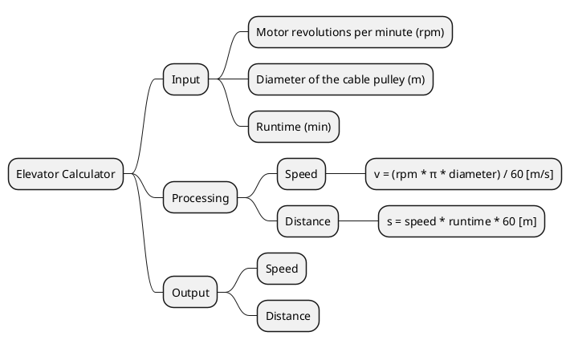

# Elevator Calculator in Java


## Task

Calculation of the speed and distance traveled by a freight elevator.

## Parameters

- Motor revolutions per minute,
- Diameter of the cable pulley in meters,
- Runtime in minutes,

## Representation of the procedure in a tree diagram

```text
Elevator Calculator
├── Input
│   ├── Motor revolutions per minute (rpm)
│   ├── Diameter of the cable pulley (m)
│   └── Runtime (min)
├── Processing
│   ├── Speed
│   │   └── v = (rpm * π * diameter) / 60 [m/s]
│   └── Distance
│       └── s = speed * runtime * 60 [m]
└── Output
    ├── Speed
    └── Distance
```


